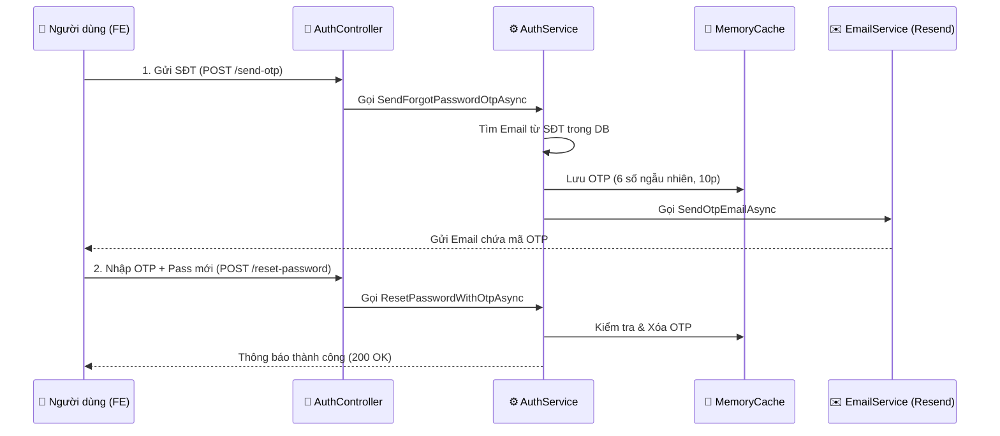

# 📧 Quên Mật Khẩu – Xác thực mã OTP qua Email (Resend.com)

Hệ thống cung cấp luồng phục hồi mật khẩu an toàn thông qua mã xác thực (OTP) gửi trực tiếp tới Email của người dùng nhờ dịch vụ **Resend.com**.

---

## 🏗️ Kiến trúc & Luồng xử lý (Workflow)



---

## ⚙️ Cấu hình Backend

Để hệ thống hoạt động, bạn cần cấu hình mã API của Resend trong file `appsettings.json`:

```json
"ResendSettings": {
  "ApiKey": "re_your_api_key_here",
  "FromEmail": "onboarding@resend.dev"
}
```

---

## 📡 Danh sách API

### 1. Yêu cầu gửi mã OTP
**Endpoint:** `POST /api/Auth/forgot-password/send-otp`  
**Mô tả:** Hệ thống tự động tìm Email liên kết với SĐT và gửi mã.

- **Request Body:**
  ```json
  { "phone": "0987654321" }
  ```
- **Phản hồi thành công:**
  ```json
  {
    "success": true,
    "message": "Mã OTP đã được gửi về email của bạn (hoan****@gmail.com). Mã có hiệu lực trong 10 phút."
  }
  ```

### 2. Xác thực OTP & Đổi mật khẩu
**Endpoint:** `POST /api/Auth/forgot-password/reset-password`  
**Mô tả:** Kiểm tra mã trong bộ nhớ tạm và cập nhật mật khẩu mới (BCrypt Hash).

- **Request Body:**
  ```json
  {
    "phone": "0987654321",
    "otp": "123456",
    "newPassword": "MatkhauMoi@2026"
  }
  ```

---

## 🛠️ Xử lý lỗi thường gặp (Troubleshooting)

1.  **Lỗi 403 Forbidden (Nghiêm trọng):**
    *   **Nguyên nhân:** Bạn đang gửi tới mail lạ mà chưa xác thực Domain trên Resend.
    *   **Khắc phục:** Hãy đảm bảo Email của người dùng trong DB khớp với Email đăng ký tài khoản Resend. Hoặc vào Resend xác thực tên miền riêng.
2.  **Không nhận được Email:**
    *   Kiểm tra mục **Spam (Thư rác)** vì `onboarding@resend.dev` hay bị đánh dấu spam.
3.  **Lỗi OTP không hợp lệ:**
    *   Mã OTP chỉ có hiệu lực **10 phút**. Sau 10 phút, mã sẽ tự động bị xóa khỏi bộ nhớ hệ thống.

---

## 📁 Cấu trúc Code liên quan
- `API/Service/IEmailService.cs`: Định nghĩa dịch vụ gửi mail.
- `API/Service/EmailService.cs`: Tích hợp gọi REST API của Resend.
- `API/Service/AuthService.cs`: Xử lý logic nghiệp vụ, sinh mã ngẫu nhiên & quản lý Cache.
- `Program.cs`: Đăng ký DI cho `IEmailService`, `HttpClient` và `MemoryCache`.
